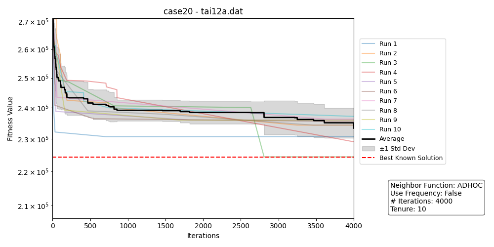
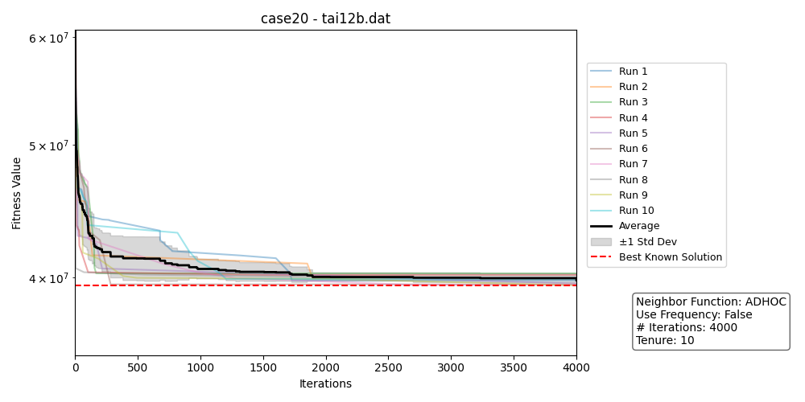
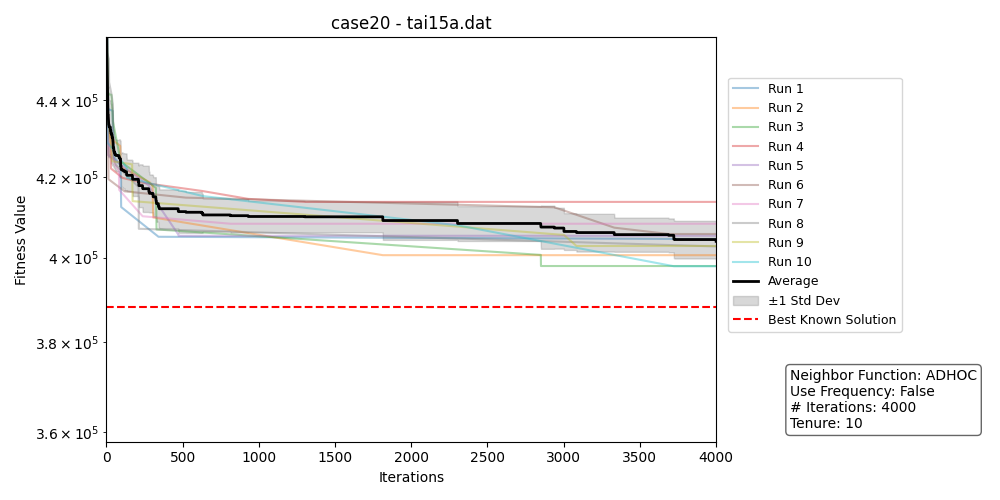
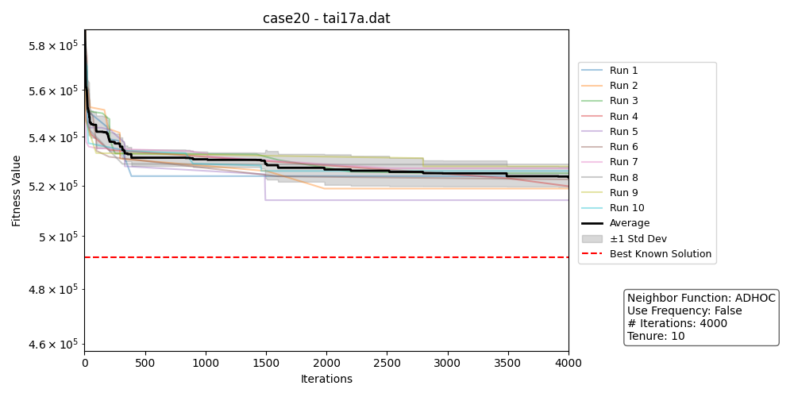
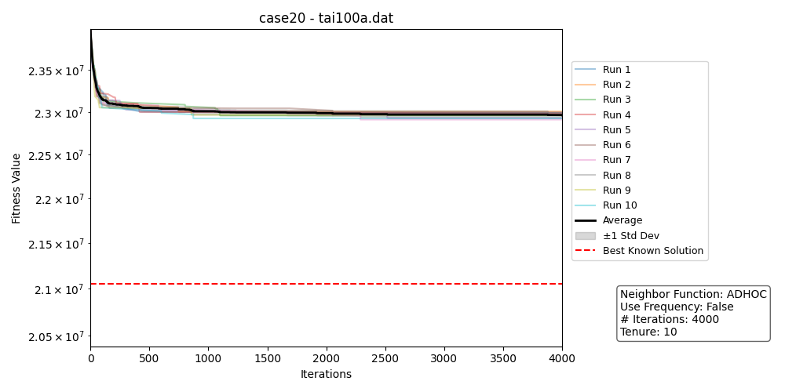

# Metaheuristic's Project Report - Taboo Search

<p align="center"><em>Prepared by:</em> <strong>Behnam Bojnordi Arbab</strong></p>

<p align="center"><em>Student number:</em> <strong>23600334</strong></p>

<p align="center"><em>CMPE536 - Metaheuristics</em></p>
<p align="center"><em>Instructor:</em> <strong>Asst. Prof. Dr. Ahmet Ünveren</strong></p>
<p align="center"><em>Eastern Mediterranean University</em></p>
<p align="center"><em>Spring 2025</em></p>

- [Metaheuristic's Project Report - Taboo Search](#metaheuristics-project-report---taboo-search)
  - [Introduction](#introduction)
  - [Installation and execution](#installation-and-execution)
    - [Prerequisites](#prerequisites)
    - [Running the Code](#running-the-code)
      - [Arguments](#arguments)
      - [Example](#example)
  - [Results and Analysis](#results-and-analysis)
    - [Configurations](#configurations)
    - [Generating Results](#generating-results)
    - [Results evaluation](#results-evaluation)
  - [Future work and further enhancements](#future-work-and-further-enhancements)
  - [Conclusion](#conclusion)

## Introduction

Taboo Search is a metaheuristic optimization algorithm designed to solve combinatorial and nonlinear problems. It enhances the performance of local search methods by using memory structures that describe the visited solutions or user-defined rules. The algorithm avoids cycling back to previously explored solutions by maintaining a "taboo list," which temporarily forbids or penalizes moves that would reverse recent changes. This approach enables the search to escape local optima and explore a broader solution space, making Taboo Search effective for complex optimization tasks such as scheduling, routing, and resource allocation.

In this project, the implementation of the Taboo Search algorithm is tailored to address a specific optimization problem. The code is structured to initialize a candidate solution, iteratively explore its neighborhood, and update the solution based on objective function evaluations. A taboo list is maintained to prevent revisiting recently explored solutions, thereby encouraging the search to escape local optima. The algorithm continues this process for a predefined number of iterations or until a satisfactory solution is found.

The project is organized into modular components, separating the core Taboo Search logic from problem-specific details such as solution representation and neighborhood generation. This modularity allows for easy adaptation to different optimization problems. The results demonstrate the effectiveness of Taboo Search in finding high-quality solutions within reasonable computational time, highlighting its practical applicability to real-world combinatorial optimization challenges.

The target problem is [**Quadratic Assignment Problem (QAP)**](https://coral.ise.lehigh.edu/data-sets/qaplib/qaplib-problem-instances-and-solutions/#Ta).

The code is available on [Github](https://github.com/behnamarbab/taboo_search).

## Installation and execution

To install and run the Taboo Search code, follow these steps:

### Prerequisites

- Python 3.7 or higher
- Required packages: `pandas`

Install dependencies using pip:

```bash
pip install pandas
```

### Running the Code

Navigate to the project directory and run the script using:

```bash
python main.py [-f DATA_FILE] [-t TENURE] [-i ITERATIONS] [-r RUNS] [-s SEED] [test_all]
```

#### Arguments

- `test_all` (optional): If specified, runs all tests. The configurations for all tests are in `config.json`.
- `-f`, `--file`: Path to the data file (default: `tai12a.dat`).
- `-t`, `--tenure`: Tenure for the Taboo search (default: `5`).
- `-i`, `--iterations`: Number of iterations (default: `1000`).
- `-r`, `--runs`: Number of runs (default: `10`).
- `-s`, `--seed`: Random seed (default: `0`).

#### Example

```bash
python main.py -f tai17a.dat -t 7 -i 2000 -r 5 -s 42
```

This command runs the Taboo Search on `data/tai17a.dat` with a tenure of 7, for 2000 iterations, 5 runs, and a random seed of 42.

To run all tests, simply run:

```bash
python main.py test_all
```

## Results and Analysis

### Configurations

Various test configurations are provided in `configs.json`. Each configuration is different based on
```
{
    Neighboring function = {1 (SWAP), 2(REVERSE), 3(SWAP-REVERSE)},
    Use of Frequencies = {True, False},
    Number of iterations = {1000, 4000},
    Tenure value = {5, 10}
}
```

As a result, there are 24 test cases generated for this experiment. It is also to be noted that for the `Neighboring function = 3 (SWAP-REVERSE)`, the selection of the function for neighbor function is 80% for `SWAP` and 20% for `REVERSE` technique.

### Generating Results

After executing the tests using `main.py`, the results are automatically saved in two files: `best_improvements.json` and `results.md`. These files contain detailed information about the performance and outcomes of the Taboo Search runs.

To analyze these results and generate visualizations, use the `illustrate_and_analysis.py` module. Simply run the following command in your terminal:

```bash
python illustrate_and_analysis.py
```

This script will process the stored results and perform all remaining analysis tasks, providing insights and summaries based on the test outcomes.
Executes a series of tests and stores the results in the files [best_improvements.json](results/best_improvements.json) and [results.md](results/results.md). These files contain the outcomes of the test executions and can be used for further analysis. 

<div style="display: flex; gap: 10px; justify-content: center;">
  
</div>
<div style="display: flex; gap: 10px; justify-content: center;">
  
</div>
<div style="display: flex; gap: 10px; justify-content: center;">
  
</div>
<div style="display: flex; gap: 10px; justify-content: center;">
  
</div>
<div style="display: flex; gap: 10px; justify-content: center;">
  
</div>

<p align="center"><em>Figure 1: Results for Case 20</em></p>

### Results evaluation

All the results are stored in `results/` directory. The runs are compared based on the best fitness found.
- The final fitness value is better with more number of iterations, hence there are some runs with 1000 iterations which find the optimal solution.
- There is a noticeable difference between the runs which use `REVERSE` as the neighboring function, compared to the other two.
- Based on the [rankings](results/csv_rankings/), there isn't much of a difference between the performance of `SWAP` and `SWAP-REVERSE` neighboring functions.
- The change in the `Tenure` did not show any difference for the results, yet, it is not concluded that it is irrelevant.
- The use of `Frequencies` is not shown to be effective drastically in this experiment.

## Future work and further enhancements

Here are some future works and possible enhancements on this work:

- Provide time measurements for a better evaluation of the performances of different runs.
- Provide more neighboring functions, and a mixture of them. Also, the probabilities should be put in the configurations file.
- More `Tenure` values to check their effect on the runs.
- Provide better configurations to check effectiveness of `Frequencies`.

## Conclusion

This experiment shows the performance of **Taboo Search** on the given QAP.